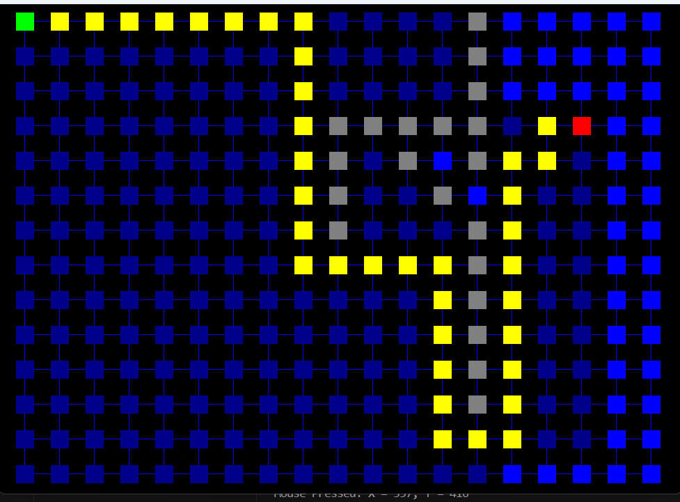
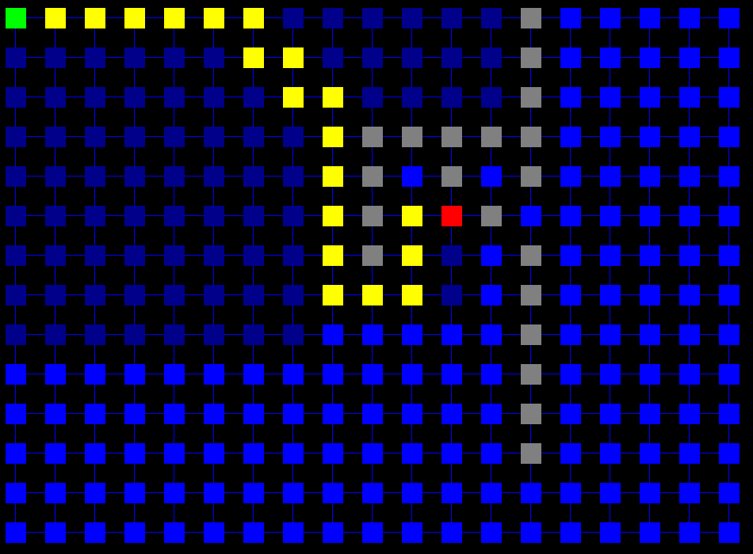
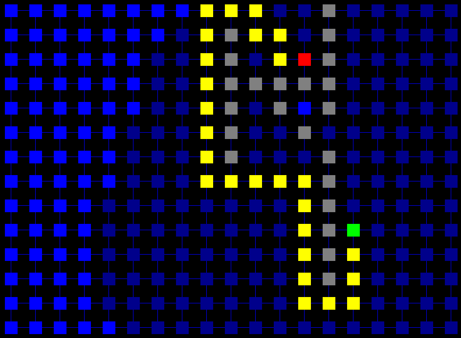

# A custom Linked list tested with A* pathfinding Algorythm

## Features

- A linked list with a basic funtionality for the demo to work

### I needed to practice Java a little for an exam in my uni, so I decided to make a small demo which will encompass majority of what was covered on the lectures, so I ended up making a custom LinkedList which is sufficient enough to use for the demo I made using a simple graphical framework in Java that was also covered on the lectures.

## A couple of screenShots:

